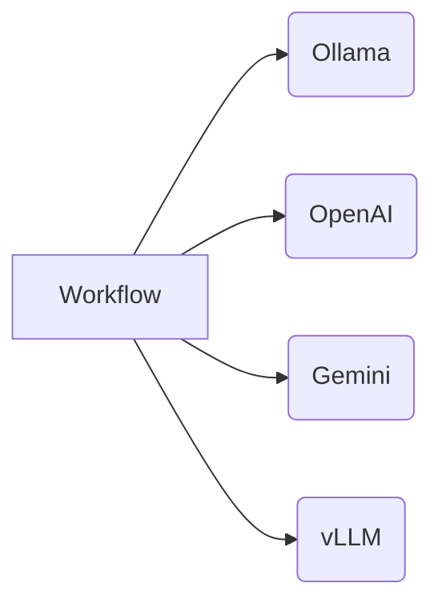

# contenox/runtime: GenAI Orchestration Runtime


**contenox/runtime** is an open-source runtime for orchestrating generative AI workflows. It treats AI workflows as state machines, enabling:

✅ **Declarative workflow definition**
✅ **Built-in state management**
✅ **Vendor-agnostic execution**
✅ **Observability with passion**
✅ **Made with Go for intensive load**

## ⚡ Get Started in 3 Minutes

### Prerequisites
- Docker and Docker Compose
- `curl` and `jq` (for CLI examples)

### 1. Launch the Runtime
```bash
git clone https://github.com/contenox/runtime.git
cd runtime
docker compose build
docker compose up -d
```

This starts the complete environment:
- Runtime API (port 8081)
- Ollama (port 11435)
- Postgres, NATS, Valkey, and tokenizer services

### 2. Register Your Ollama Backend
```bash
BACKEND_ID=$(curl -s -X POST http://localhost:8081/backends \
  -H "Content-Type: application/json" \
  -d '{
    "name": "local-ollama",
    "baseURL": "http://host.docker.internal:11435",
    "type": "ollama"
  }' | jq -r '.id')

echo "Backend ID: $BACKEND_ID"
```

### 3. Assign Backend to Default Pools
```bash
# For task execution
curl -X POST http://localhost:8081/backend-associations/internal_tasks_pool/backends/$BACKEND_ID

# For embeddings
curl -X POST http://localhost:8081/backend-associations/internal_embed_pool/backends/$BACKEND_ID
```

### 4. Wait for Models to Download
```bash
EMBED_MODEL="nomic-embed-text:latest"
TASK_MODEL="qwen3:4b"

echo "⏳ Downloading models (2–5 minutes)..."
while true; do
  STATUS=$(curl -s http://localhost:8081/backends/$BACKEND_ID)

  if jq -e ".pulledModels[] | select(.model == \"$EMBED_MODEL\")" <<< "$STATUS" >/dev/null && \
     jq -e ".pulledModels[] | select(.model == \"$TASK_MODEL\")" <<< "$STATUS" >/dev/null; then
    echo "✅ Models ready!"
    break
  fi
  sleep 10
  echo "⏳ Still downloading..."
done
```

### 5. Execute Your First Prompt
```bash
curl -X POST http://localhost:8081/execute \
  -H "Content-Type: application/json" \
  -d '{"prompt": "Explain quantum computing"}'
```

### 6. Create a Tasks-Chain Workflow
# Save as `qa.json`
```json
{
  "input": "What's the best way to optimize database queries?",
  "inputType": "string",
  "chain": {
    "id": "smart-query-assistant",
    "description": "Handles technical questions",
    "tasks": [
      {
        "id": "generate_response",
        "description": "Generate final answer",
        "handler": "raw_string",
        "systemInstruction": "You're a senior engineer. Provide concise, professional answers to technical questions.",
        "transition": {
          "branches": [
            {
              "operator": "default",
              "goto": "end"
            }
          ]
        }
      }
    ]
  }
}
```

Execute the workflow:
```bash
curl -X POST http://localhost:8081/tasks \
  -H "Content-Type: application/json" \
  -d @qa.json
```

## ✨ Key Features

### State Machine Engine
- **Conditional Branching**: Route execution based on LLM outputs
- **Built-in Handlers**:
  - `condition_key`: Validate and route responses
  - `parse_number`: Extract numerical values
  - `parse_range`: Handle score ranges
  - `raw_string`: Standard text generation
  - `embedding`: Embedding generation
  - `model_execution`: Model execution on a chat history
  - `hook`: Calls a user-defined hook pointing to an external service
- **Context Preservation**: Automatic input/output passing between steps

### Multi-Provider Support


- **Unified Interface**: Consistent API across providers
- **Automatic Sync**: Models stay consistent across backends
- **Pool Management**: Assign backends to specific task types
- **Backend Resolver**: Distribute requests to backends based on resolution policies

## 🧩 Extensibility

### Custom Hooks
Hooks are external servers that can be called from within task chains when registered.
[🔗 See Hook Documentation](./docs/hooks.md)

## 📘 API Documentation

The full API surface is defined in OpenAPI format:

- 🔗 [View OpenAPI Spec (YAML)](./docs/openapi.yaml)

```
