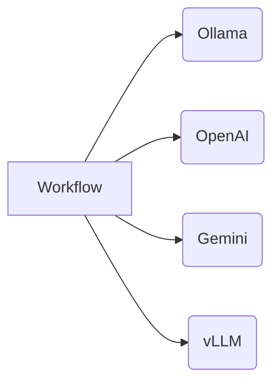

# contenox/runtime: GenAI Orchestration Runtime


**contenox/runtime** is an open-source runtime for orchestrating generative AI workflows. It treats AI workflows as state machines, enabling:

✅ **Declarative workflow definition**
✅ **Built-in state management**
✅ **Vendor-agnostic execution**
✅ **Multi-backend orchestration**
✅ **Observability with passion**
✅ **Made with Go for intensive load**
✅ **Build agentic capabilities via hooks**
✅ **Dropin for OpenAI chatcompletion API**

## ⚡ Get Started in 3 Minutes

Startup flow:

* Launch runtime services via Docker
* Register one or more model backends
* Assign each backend to the relevant execution pools
* Pull required models to the backends
* Execute a workflow and observe the logs

See your first workflow run in under 5 minutes:

### Prerequisites

* Docker and Docker Compose
* `curl` and `jq` (for CLI examples)

### 1. Launch the Runtime

```bash
git clone https://github.com/contenox/runtime.git
cd runtime
docker compose build
docker compose up -d
```

This starts the complete environment:

* Runtime API (port 8081)
* Ollama (port 11435)
* Postgres, NATS, and tokenizer services

### 2. Register Ollama Backends

```bash
BACKEND_ID=$(curl -s -X POST http://localhost:8081/backends \
  -H "Content-Type: application/json" \
  -d '{
    "name": "local-ollama",
    "baseURL": "http://ollama:11435",
    "type": "ollama"
  }' | jq -r '.id')

echo "Backend ID: $BACKEND_ID"
```

### 3. Assign Backend to Default Pools

```bash
# For task execution
curl -X POST http://localhost:8081/backend-associations/internal_tasks_pool/backends/$BACKEND_ID

# For embeddings
curl -X POST http://localhost:8081/backend-associations/internal_embed_pool/backends/$BACKEND_ID
```

### 4. Wait for Models to Download

```bash
EMBED_MODEL="nomic-embed-text:latest"
TASK_MODEL="qwen3:4b"

echo "⏳ Downloading models (2–5 minutes)..."
while true; do
  STATUS=$(curl -s http://localhost:8081/backends/$BACKEND_ID)

  if jq -e ".pulledModels[] | select(.model == \"$EMBED_MODEL\")" <<< "$STATUS" >/dev/null && \
     jq -e ".pulledModels[] | select(.model == \"$TASK_MODEL\")" <<< "$STATUS" >/dev/null; then
    echo "✅ Models ready!"
    break
  fi
  sleep 10
  echo "⏳ Still downloading..."
done
```

### 5. Execute a Prompt

```bash
curl -X POST http://localhost:8081/execute \
  -H "Content-Type: application/json" \
  -d '{"prompt": "Explain quantum computing"}'
```

### 6. Create a Task Chain Workflow

Save as `qa.json`:

```json
{
  "input": "What's the best way to optimize database queries?",
  "inputType": "string",
  "chain": {
    "id": "smart-query-assistant",
    "description": "Handles technical questions",
    "tasks": [
      {
        "id": "generate_response",
        "description": "Generate final answer",
        "handler": "raw_string",
        "systemInstruction": "You're a senior engineer. Provide concise, professional answers to technical questions.",
        "transition": {
          "branches": [
            {
              "operator": "default",
              "goto": "end"
            }
          ]
        }
      }
    ]
  }
}
```

Execute the workflow:

```bash
curl -X POST http://localhost:8081/tasks \
  -H "Content-Type: application/json" \
  -d @qa.json
```

All runtime activity is captured in structured logs, providing deep observability into workflows and system behavior.

Logs can be viewed using Docker:

```bash
docker logs contenox-runtime-kernel
```

## ✨ Key Features

### State Machine Engine

* **Conditional Branching**: Route execution based on LLM outputs
* **Built-in Handlers**:

  * `condition_key`: Validate and route responses
  * `parse_number`: Extract numerical values
  * `parse_range`: Handle score ranges
  * `raw_string`: Standard text generation
  * `embedding`: Embedding generation
  * `model_execution`: Model execution on a chat history
  * `hook`: Calls a user-defined hook pointing to an external service
* **Context Preservation**: Automatic input/output passing between steps
* **Multi-Model Support**: Define preferred models for each task chain
* **Retry and Timeout**: Configure task-level retries and timeouts for robust workflows

### Multi-Provider Support

Define preferred model provider and backend resolution policy directly within task chains. This allows for seamless, dynamic orchestration across various LLM providers.



* **Unified Interface**: Consistent API across providers
* **Automatic Sync**: Models stay consistent across backends
* **Pool Management**: Assign backends to specific task types
* **Backend Resolver**: Distribute requests to backends based on resolution policies

## 🧩 Extensibility

### Custom Hooks

Hooks are external servers that can be called from within task chains when registered.
They allow interaction with systems and data outside of the runtime and task chains themselves.
[🔗 See Hook Documentation](./docs/hooks.md)

## 📘 API Documentation

The full API surface is thoroughly documented and defined in the OpenAPI format, making it easy to integrate with other tools. You can find more details here:

* 🔗 [API Reference Documentation](./docs/api-reference.md)
* 🔗 [View OpenAPI Spec (YAML)](./docs/openapi.yaml)

Also review the [tests](./apitests) for additional context on the API documentation.
