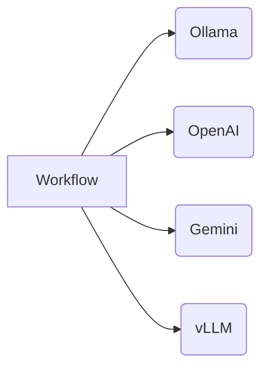
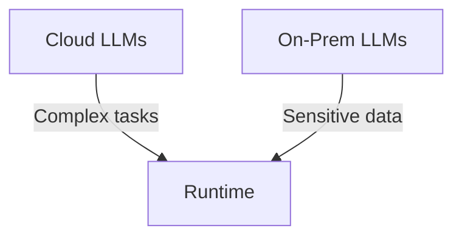

# contenox/runtime: GenAI Orchestration Runtime


**contenox/runtime** is an open-source runtime for orchestrating generative AI workflows. It treats AI workflows as state machines, enabling:

✅ **Declarative workflow definition** ✅ **Built-in state management** ✅ **Vendor-agnostic execution** ✅ **Observability with passion** ✅ **Made with Go with intensive load**

## ⚡ Get Started in 3 Minutes

### Prerequisites
- Docker and Docker Compose
- `curl` and `jq` (for CLI examples)

### 1. Launch the Runtime
```bash
git clone https://github.com/contenox/runtime.git
cd runtime
docker compose up -d
```

This starts the complete environment:
- Runtime API (port 8081)
- Ollama (port 11435)
- Postgres, NATS, Valkey, and tokenizer services

### 2. Register Your Ollama Backend
```bash
BACKEND_ID=$(curl -s -X POST http://localhost:8081/backends \
  -H "Content-Type: application/json" \
  -d '{
    "name": "local-ollama",
    "baseURL": "http://host.docker.internal:11435",
    "type": "ollama"
  }' | jq -r '.id')

echo "Backend ID: $BACKEND_ID"
```

### 3. Assign Backend to Default Pools
```bash
# For task execution
curl -X POST http://localhost:8081/backend-associations/internal_tasks_pool/backends/$BACKEND_ID

# For embeddings
curl -X POST http://localhost:8081/backend-associations/internal_embed_pool/backends/$BACKEND_ID
```

### 4. Wait for Models to Download
```bash
EMBED_MODEL="nomic-embed-text:latest"
TASK_MODEL="qwen3:4b"

echo "⏳ Downloading models (2-5 minutes)..."
while true; do
  STATUS=$(curl -s http://localhost:8081/backends/$BACKEND_ID)

  if jq -e ".pulledModels[] | select(.model == \"$EMBED_MODEL\")" <<< "$STATUS" >/dev/null && \
     jq -e ".pulledModels[] | select(.model == \"$TASK_MODEL\")" <<< "$STATUS" >/dev/null; then
    echo "✅ Models ready!"
    break
  fi
  sleep 10
  echo "⏳ Still downloading..."
done
```

### 5. Execute Your First Prompt
```bash
curl -X POST http://localhost:8081/execute \
  -H "Content-Type: application/json" \
  -d '{
    "prompt": "Explain quantum computing like I'm five"
  }'
```

### 6. Create a Tasks-Chain Workflow
```yaml
# save as sky_question.yaml
input: "Is the sky blue?"
inputType: string
chain:
  id: sky-color-verification
  tasks:
    - id: validate
      handler: condition_key
      validConditions:
        valid: true
        invalid: true
      promptTemplate: |
        Is this a valid question? {{.input}}
        Respond exactly with either "valid" or "invalid"
      transition:
        branches:
          - when: valid
            goto: answer
          - when: invalid
            goto: reject

    - id: answer
      handler: raw_string
      promptTemplate: Answer this question: {{.input}}
      transition:
        branches:
          - operator: default
            goto: end

    - id: reject
      handler: raw_string
      promptTemplate: This is not a valid question: {{.input}}
      transition:
        branches:
          - operator: default
            goto: end
```

Execute the workflow:
```bash
curl -X POST http://localhost:8081/tasks \
  -H "Content-Type: application/json" \
  -d @sky_question.yaml
```

## ✨ Key Features

### State Machine Engine
- **Conditional Branching**: Route execution based on LLM outputs
- **Built-in Handlers**:
  - `condition_key`: Validate and route responses
  - `parse_number`: Extract numerical values
  - `parse_range`: Handle score ranges
  - `raw_string`: Standard text generation
  - `embedding`: Embedding generation
  - `model_execution`: Model execution on a chat-history
  - `hook`: Calls a user-defined hook pointing to a external service
- **Context Preservation**: Automatic input/output passing between steps

### Multi-Backend Support


- **Unified Interface**: Consistent API across providers
- **Automatic Sync**: Models stay consistent across backends
- **Pool Management**: Assign backends to specific task types
- **Load Balancing**: Distribute requests to the backends based via resolution policies
## 🧩 Extensibility

### Custom Hooks
Hooks are external servers that are callable withi the taskschains if registered. TODO: point to the documentation.

### Hybrid Deployments



_____


TODO WRITE THESE:
## 📚 Documentation
- [API Reference](docs/api.md)
- [Workflow Specification](docs/workflow-spec.md)
- [Backend Management](docs/backends.md)
- [Handler Library](docs/handlers.md)

TODO SETUP THESE:
## 🚀 Getting Help
Join our community for support:
- [GitHub Discussions](https://github.com/contenox/runtime/discussions)
- [Discord Channel](https://discord.gg/contenox)

## 🤝 Contributing
We welcome contributions! Please see our:
- [Contribution Guide](CONTRIBUTING.md)
- [Good First Issues](https://github.com/contenox/runtime/contribute)
