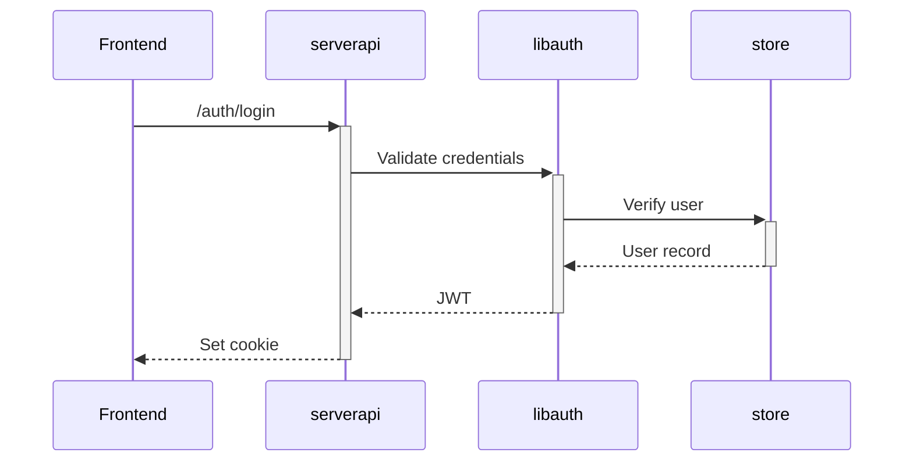

# contenox/runtime-mvp

`shifting agency from the LLM to defined behavior`


> **Build context-aware AI systems with LLMs** — An open runtime for Autonomous Agents (Bots) and Co-Pilots (Frontends) with shared behavior logic.

This MVP showcases a vision for building **agent systems** that:

* Execute chained operations using natural language
* Route events to contextual agents with dynamic behavior loading
* Enable custom automations via **Task Chains**
* Support secure, extensible Co-Pilot experiences
* Offer full control — no black-box dependencies

---

## 🚀 Core Capabilities

| Feature              | Enables                                                                 |
| -------------------- | ----------------------------------------------------------------------- |
| 🧠 **Task Chains**       | Define agent behaviors via DSL; load dynamically at runtime             |
| 🔍 **RAG Engine**        | Semantic search + Q&A over documents with scalable **Vald vector search** |
| 🤖 **Agent Dispatch**    | Multi-stage job system for processing external events                   |
| 🪝 **Extensible Hooks**  | Connect APIs, databases, or custom logic with contextual params         |
| 🔁 **LLM Orchestration** | Route to **OpenAI, vLLM, Gemini, Ollama**, and more with pluggable backends |
| 💬 **Chat Commands**     | Trigger tasks like `/search`, `/help`, etc. from any interface          |

---

## 🧠 In Short

The **primary goal** of this MVP is to prove how a single state-machine can power both user-facing Co-Pilots and fully autonomous Agents — with support for **observability**, **security**, and **compliance**.

A **secondary goal** is to demonstrate the scalability of the dispatch infrastructure under real-world loads.

> ⚠️ **Note**: This codebase is actively evolving. Not all features are final.
> See [DEVELOPMENT_SLICES.md](DEVELOPMENT_SLICES.md) for the roadmap.

---

## 🌐 Interaction Models

### 👤 **Co-Pilots (Frontends)**
User-facing interfaces where humans interact directly with task chains:
* Telegram bot
* OpenAI-compatible API endpoints
* Custom web chat UIs
* CLI interfaces

> Co-Pilots maintain per-user conversation history and respond in real time.

### 🤖 **Autonomous Agents (Bots)**
Agents that monitor and act on external systems:
* GitHub PR comment processing
* Content moderation
* Social media workflows
* Internal dev automation

> Bots maintain independent context histories per source (e.g., GitHub PR) and operate continuously via event-driven jobs.
> The admin can manage bots and Co-Pilots, assign task chains, upload documents, and monitor agents through the web dashboard.

---

## ⚙️ Architecture Overview

| Layer      | Tech Stack                   |
| ---------- | ---------------------------- |
| **Backend**    | **Go** (core logic, task engine, LLM orchestration) |
| **Frontend**   | **React + TypeScript** (admin UI, chat interfaces) |
| **LLMs**       | **Ollama, vLLM, OpenAI, Gemini** (via `libmodelprovider`) |
| **Vector DB**  | **Vald** (semantic search, document embeddings) |
| **Database**   | **PostgreSQL** (state storage, job tracking) |
| **Auth**       | **JWT + custom ACL** (role-based access control) |
| **Deployment** | **Docker** (microservices, workers, vector DB) |

> **Additional Components**:
> - **Tokenizer Service** (Go microservice via gRPC for token counting)
> - **Python Workers** (async pipelines for doc processing)
> - **NATS/pubsub** (event-driven communication between services)

---

## 🔌 Technical Highlights

* **Agent Dispatch**: Multi-stage pipeline for external event handling
* **Task Engine**: Go-based state machine with **task leasing, chaining, and variable composition**
* **Vector Pipeline**: End-to-end document processing + semantic retrieval
* **Authentication**: Fine-grained access control via JWT and custom ACL
* **Frontend**: Lightweight admin and interaction dashboard
* **Bot Integrations**: GitHub (ready), Telegram (ready), Slack (in progress)

---

### 🧰 Codebase & Tooling

* **Go Core**: Orchestration, logic, integrations
* **React Admin**: Chat + admin UI
* **Python Workers**: Async pipelines for doc processing
* **API Tests**: Python test suite
* **Dockerized Dev**: Container setup for local development

---

## 🧩 Task Chains & Contextual Execution

Task chains are declarative state machine instances composed of modular steps (called *tasks*). Tasks support variables, branching, and pluggable hooks. They power both Co-Pilots and Agents.

Chains can be created live via the admin UI and shared across different agents while keeping their own context and state.

### 🧪 Example: GitHub Comment Moderation

```yaml
id: github_comment_chain
description: Process GitHub comments with contextual awareness
tasks:
  - id: moderate
    type: parse_number
    prompt_template: "Classify input safety (0=safe, 10=spam): {{.input}}"
    input_var: input
    transition:
      branches:
        - operator: ">"
          when: "4"
          goto: reject_request
        - operator: default
          goto: execute_chat_model

  - id: execute_chat_model
    type: model_execution
    system_instruction: "You're a helpful GitHub assistant. Reference PR context when relevant."
    execute_config:
      models:
        - gemini-2.5-flash
      providers:
        - gemini
    input_var: input
    transition:
      - operator: default
        goto: end
```

---

## ⚡ How Agent Dispatch Works

contenox processes external events through a structured pipeline:

1. **Event Detection**:
   ```go
   // GitHub comment poller
   comments, err := w.githubService.ListComments(ctx, repoID, prNumber, lastSync)
   ```

2. **Job Creation**:
   ```go
   job := &store.Job{
     ID:        uuid.NewString(),
     TaskType:  JobTypeGitHubProcessCommentLLM,
     Subject:   fmt.Sprintf("%s:%d", repoID, prNumber),
     Payload:   payload,
   }
   ```

3. **Agent Execution**:
   ```go
   bots, err := storeInstance.ListBotsByJobType(ctx, job.TaskType)
   chain, err := tasksrecipes.GetChainDefinition(ctx, p.db, bot.TaskChainID)
   result, trace, err := p.env.ExecEnv(ctx, chain, payload.Content, taskengine.DataTypeString)
   ```

Each job routes to the appropriate bot and executes its assigned chain, preserving per-subject history.

---

## 🔐 Authentication Flow



---

## 🛠️ Getting Started

1. Ensure `go` `docker` and `corepack` + `yarn` are **installed**.
> Note: only linux is supported.

2. Copy the example env file:

```bash
cp .env-example .env
```

3. Start the services:

```bash
make run        # backend + workers + vector DB
make ui-run     # React frontend (proxied via backend)
```

4. Access the UI at: [http://localhost:8081](http://localhost:8081)
   Login as `admin@admin.com`.

> **Note**: The UI runs through the backend proxy on port `8081` — not Vite’s default.
