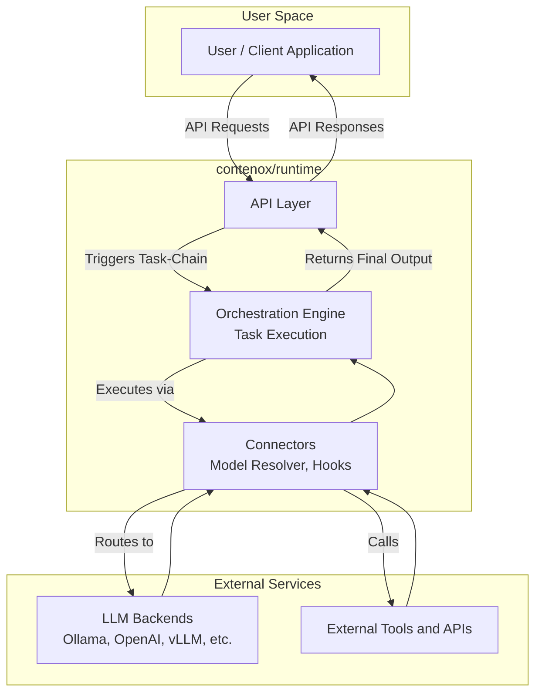

# contenox/runtime: GenAI Orchestration Runtime


**contenox/runtime** is an open-source runtime for orchestrating generative AI workflows. It treats AI workflows as state machines, enabling:

✅ **Declarative workflow definition**
✅ **Built-in state management**
✅ **Vendor-agnostic execution**
✅ **Multi-backend orchestration**
✅ **Observability with passion**
✅ **Made with Go for intensive load**
✅ **Build agentic capabilities via hooks**
✅ **Drop-in for OpenAI chatcompletion API**

-----

## ⚡ Get Started in 1-3 Minutes

This single command will start all necessary services, configure the backend, and download the initial models.

### Prerequisites

  * Docker and Docker Compose
  * `curl` and `jq`

### Run the Bootstrap Script

```bash
git clone https://github.com/contenox/runtime.git
cd runtime
./scripts/bootstrap.sh nomic-embed-text:latest phi3:3.8b # or any other models
# at least one embedding model and one instruction model is required.
```

Once the script finishes, the environment is fully configured and ready to use.

-----

### Try It Out: Execute a Prompt

After the bootstrap is complete, test the setup by executing a simple prompt:

```bash
curl -X POST http://localhost:8081/execute \
  -H "Content-Type: application/json" \
  -d '{"prompt": "Explain quantum computing in simple terms"}'
```

### Next Steps: Create a Workflow

Save the following as `qa.json`:

```json
{
  "input": "What's the best way to optimize database queries?",
  "inputType": "string",
  "chain": {
    "id": "smart-query-assistant",
    "description": "Handles technical questions",
    "tasks": [
      {
        "id": "generate_response",
        "description": "Generate final answer",
        "handler": "raw_string",
        "systemInstruction": "You're a senior engineer. Provide concise, professional answers to technical questions.",
        "transition": {
          "branches": [
            { "operator": "default", "goto": "end" }
          ]
        }
      }
    ]
  }
}
```

Execute the workflow:

```bash
curl -X POST http://localhost:8081/tasks \
  -H "Content-Type: application/json" \
  -d @qa.json
```

All runtime activity is captured in structured logs:

```bash
docker logs contenox-runtime-kernel
```

-----

## ✨ Key Features

### State Machine Engine

  * **Conditional Branching**: Route execution based on LLM outputs
  * **Built-in Handlers**:
      * `condition_key`: Validate and route responses
      * `parse_number`: Extract numerical values
      * `parse_range`: Handle score ranges
      * `raw_string`: Standard text generation
      * `embedding`: Embedding generation
      * `model_execution`: Model execution on a chat history
      * `hook`: Calls a user-defined hook pointing to an external service
  * **Context Preservation**: Automatic input/output passing between steps
  * **Multi-Model Support**: Define preferred models for each task chain
  * **Retry and Timeout**: Configure task-level retries and timeouts for robust workflows

### Multi-Provider Support

Define preferred model provider and backend resolution policy directly within task chains. This allows for seamless, dynamic orchestration across various LLM providers.

#### Architecture Overview



  * **Unified Interface**: Consistent API across providers
  * **Automatic Sync**: Models stay consistent across backends
  * **Pool Management**: Assign backends to specific task types
  * **Backend Resolver**: Distribute requests to backends based on resolution policies

-----

## 🧩 Extensibility

### Custom Hooks

Hooks are external servers that can be called from within task chains when registered. They allow interaction with systems and data outside of the runtime and task chains themselves.
[🔗 See Hook Documentation](https://www.google.com/search?q=./docs/hooks.md)

-----

## 📘 API Documentation

The full API surface is thoroughly documented and defined in the OpenAPI format, making it easy to integrate with other tools. You can find more details here:

  * 🔗 [API Reference Documentation](https://www.google.com/search?q=./docs/api-reference.md)
  * 🔗 [View OpenAPI Spec (YAML)](https://www.google.com/search?q=./docs/openapi.yaml)

The [API-Tests](https://www.google.com/search?q=./apitests) are available for additional context.
