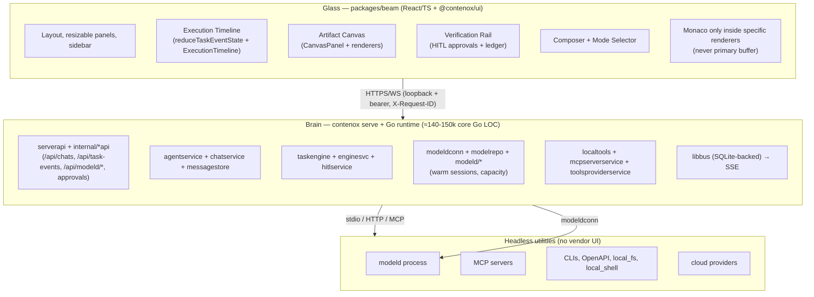

# Blueprint: Sovereign Workspace

> **Owner:** runtime / beam  
> **Companions:** [chat-canvas.md](../beam/chat-canvas.md), [local-runtime-cockpit.md](../beam/local-runtime-cockpit.md), [http-ui-revival.md](../beam/http-ui-revival.md), [../chat-modes-context.md](../chat-modes-context.md), [../local-coding-node-goals.md](../local-coding-node-goals.md), [../product-surface-truth-blueprint.md](../product-surface-truth-blueprint.md), [../windows/windows-product-surface.md](../windows/windows-product-surface.md), [multi-client-coordination.md](../modeld/multi-client-coordination.md)  
> **Supersedes (positioning):** portions of `v1-feature-map.md` that excluded `contenox serve` + Beam from primary surface.

## Overview

Contenox is building **UX sovereignty** by elevating `contenox serve` + the Beam browser SPA (`packages/beam`) to the primary human-facing product surface. The ≈140-150k core Go runtime (runtime/ + cmd/ + modeld/) remains the authoritative "brain" (orchestration, chains, HITL, modeld, tools, MCP, taskengine, sessions). React/TS + embedded Monaco (only inside specific artifact renderers) provides the "glass" (layout, timeline, artifact canvas, verification ledger).

The strategic shift recognizes that users primarily orchestrate agents and review artifacts (diffs, plans, specs, logs, run results) rather than type character-by-character. Traditional editor metaphors (file-tree-first, Copilot chat chrome) cede the context window and onboarding experience to vendors. The Sovereign Workspace (Beam) owns the full context window as a demilitarized control center: Execution Timeline | Artifact Canvas | Verification.

`contenox serve` becomes the hero entry point. CLI (`contenox chat`, `contenox run`) and ACP/VS Code (`packages/vscode`, `libacp`) become secondary install vehicles, automation hooks, and attachments for users who still type in an editor.

This document formalizes the decision record, concrete architecture, data flows, slices, risks, and PR plan.

## Background & Motivation

### Current State (verify against code before relying on this)

- **Brain is strong and complete:** `runtime/taskengine` + `hitlservice` + `agentservice` + `chatservice` + `messagestore` + `enginesvc` + `modeld/*` + `localtools` + `libacp` deliver durable chains, policy-gated execution, warm local context via `modeldconn`, tool/MCP wrapping, and streaming task events over `libbus` + SSE.
- **Glass exists but is secondary:** `packages/beam` (React/TS, Vite, `@contenox/ui` shared components, Monaco via `@monaco-editor/react`) serves chat (`packages/beam/src/pages/admin/chats/ChatPage.tsx`, `packages/beam/src/pages/admin/chats/components/ChatInterface.tsx`, `packages/beam/src/pages/admin/chats/components/WorkspaceSplitPanel.tsx`), admin pages, modeld cockpit hooks (`packages/beam/src/hooks/useModeldStatus.ts`), artifact registry (`packages/beam/src/lib/artifacts/registry.ts`), and task event reduction (`packages/beam/src/lib/taskEvents.ts`). It is served at `/` by `runtime/internal/web` + `runtime/contenoxcli/serve_cmd.go`.
- **API bridge:** `runtime/serverapi/server.go` + `runtime/internal/internalchatapi/chatroutes.go`, `runtime/internal/taskeventsapi/routes.go`, `runtime/internal/approvalapi/routes.go`, `runtime/internal/modeldapi/routes.go`, etc. expose `/api/*` (loopback + optional bearer). Beam calls these exclusively (`packages/beam/src/lib/api.ts`).
- **Positioning lag:** README/website still lead with "plugs into VS Code/Zed". `v1-feature-map.md` excluded Beam from V1 hero paths. Editor integrations gate AI surface (Copilot chat, Zed WASM agent chrome).
- **Existing partial canvas work:** Artifact registry for `ChatContextArtifact` (sent to model) in `packages/beam/src/lib/artifacts/registry.ts`, `packages/ui/src/components/visualization/ExecutionTimeline.tsx` (inside messages only), `packages/beam/src/pages/admin/chats/components/ChatRunLog.tsx` (unused as default rail), live SSE reduction in `packages/beam/src/lib/taskEvents.ts`, `packages/beam/src/pages/admin/chats/components/WorkspaceSplitPanel.tsx` (currently Terminal-only stub), mode selector scaffolding (`ChatModeId` in `packages/beam/src/lib/types.ts`).

### Pain Points

1. **Vendor capture of context window:** "vscode and zed etc are fucking branded as being open and extensible ... they are unless you want to integrate AI features." Onboarding and review flows are owned by the editor's agent UI.
2. **Wrong primary metaphor:** File tree + typing buffer is mismatched for "orchestrate + review agent artifacts." Run logs are telemetry, not the object of attention.
3. **Boiling the ocean on integrations:** Every new editor or tool vendor requires fighting for pixels. Headless (API/CLI/MCP) is the only reliable integration contract.
4. **Fragmented surfaces:** Chat history, approvals, modeld status, terminal, and chain outputs live in different places (CLI, Beam pages, VS Code webview, ACP).

The "build our own IDE" conclusion was initially perplexing because full editors are millions of LoC with custom buffers. The insight: **we do not need a text buffer as the product**. We need ownership of the governance surface.

### Implementation Readiness Matrix (verify against code before relying on this)

| Component                  | Client (Beam/React)          | Server (Go)                          | Notes |
|----------------------------|------------------------------|--------------------------------------|-------|
| Chat send + optimistic     | Full (`packages/beam/src/pages/admin/chats/ChatPage.tsx`, `packages/beam/src/lib/api.ts`) | Basic message only (`runtime/internal/internalchatapi/chatroutes.go`) | Context/mode fields prepared client-side |
| Mode + context injection   | Scaffolding + send          | Not implemented (chatroutes only Message) | PR 2 target |
| TaskEvent + SSE            | reduceTaskEventState + attachments handling (defensive) (`packages/beam/src/lib/taskEvents.ts`) | Core kinds (no attachments field yet) (`runtime/taskengine/events.go`) | Go struct in taskengine/events.go |
| Artifact registry (context vs canvas) | Full (types + registry) (`packages/beam/src/lib/artifacts/registry.ts`) | None (client only for now)          | CanvasArtifact is future |
| Approval flow              | Partial (inline + policies page) | Full (hitlservice + approvalapi)   | Good foundation |
| ExecutionTimeline          | Used inside messages (`packages/beam/src/pages/admin/chats/components/ChatMessage.tsx`) | Events emitted                      | Promote to column in PR 5 |
| WorkspaceSplitPanel        | Terminal stub only (`packages/beam/src/pages/admin/chats/components/WorkspaceSplitPanel.tsx`) | N/A                                 | Evolve to CanvasPanel |

All "glass" innovations before PR 2 are view-only or will be inert until server wire lands.

### Current Gaps (verify against code before relying on this)

- `chatRequest` in `runtime/internal/internalchatapi/chatroutes.go` accepts `mode` + `context`, passes them to `agentservice.Prompt`, and `agentservice.ComposeUserInput` injects them into the model-visible user message (mode prefix + "Additional context" block). Truth-tested in `chatroutes_test.go` (`TestUnit_ChatPassesModeAndContextToAgent`) and `agentservice/composeinput_test.go`. Full mode→chain dispatch is still open.
- `taskengine.TaskEvent` has no `attachments`/`WidgetHint` fields — deliberately: no producer exists yet, and speculative plumbing was removed. Add the field together with its first real producer.
- No Go-side artifact kind renderers or `chatsessionmodes/artifact_kinds.go` exist (TS comments in `packages/beam/src/lib/artifacts/types.ts` reference planned Go parity).
- `ExecutionTimeline` (`packages/ui/src/components/visualization/ExecutionTimeline.tsx`) renders inside chat messages and the workspace rail's `TimelinePanel`; not a top-level column.
- `ChatRunLog` component exists (`packages/beam/src/pages/admin/chats/components/ChatRunLog.tsx`) but is not the active side-rail in current `ChatPage.tsx`.

See `chat-modes-context.md` for the fuller mode-resolution design.

## Goals & Non-Goals

### Goals

- Own the end-to-end user journey for high-consequence agentic work inside a single sovereign surface (Beam served by `contenox serve`).
- Keep the Go runtime (≈140-150k core Go LOC in runtime + cmd + libs, excluding tests/generated) as the single source of truth for execution, state, policy, and model sessions. Never duplicate orchestration in TypeScript.
- Evolve Beam into a three-column control center: Execution Timeline (events from `taskengine.TaskEvent`), Artifact Canvas (human-inspect `CanvasArtifact`), Verification (HITL + evidence from `hitlservice`).
- Use Monaco **only** as an embeddable renderer inside a canvas artifact (e.g., editable code diff or file view). React owns all shell, panels, layout, and most rich renderers.
- Make `contenox serve` the default happy path in docs, website hero, and first-run experience.
- Preserve and improve secondary surfaces (ACP stdio, VS Code extension, CLI) as attachments.
- Pass the product-surface-truth bar: every promoted panel or journey must have E2E coverage or stay behind a flag.

### Non-Goals

- Fork VS Code, Zed, or any editor core (no custom text buffer work; no competing on raw typing latency).
- Rebuild chain execution, HITL, modeld, `taskengine`, or `messagestore` in React.
- Make the full Beam experience a general-purpose code editor with file-tree-first landing.
- Own vendor agent UIs inside Beam (keep them headless behind Go services).
- Cloud multi-tenant control plane for repo-touching flows (local-first + explicit remote connector later).
- Multiplayer editing semantics in v1 (review sharing via links is later; see auth.md + remote-connector.md).

### Explicit Decision Filter (must answer "yes" to all)

1. Can the Go runtime drive the underlying system **headlessly** (API/CLI/MCP) without relying on the vendor's agent chrome?
2. Does the feature require owning the full context window (timeline + canvas + verification) for the user?
3. Is the primary user action review/direct/steer rather than raw syntax typing?

If (1) is no → fix integration layer first. If (2) is no → use CLI/ACP. If (3) is no → editor attachment is acceptable.

## Proposed Design

### Brain / Glass Split (Canonical Architecture)



**Boundary invariants (enforced today and preserved):**

- Beam **never** calls `modeld` directly. All access is via `/api/modeld/*` (`runtime/internal/modeldapi/routes.go`, `packages/beam/src/hooks/useModeldStatus.ts`, `local-runtime-cockpit.md`).
- Mode resolution + context injection **will occur once** at the HTTP boundary (planned in `internalchatapi` per `chat-modes-context.md`; currently client-collected only).
- `ChatContextArtifact` (for model) is distinct from future `CanvasArtifact` (for human). See `packages/beam/src/lib/artifacts/types.ts` and `chat-canvas.md`.
- Execution state lives in Go (`taskengine.CapturedStateUnit`, `messagestore`, session tables). Glass is a view + steering surface.
- `contenox serve` in `runtime/contenoxcli/serve_cmd.go` wires `Agent`, `HITLService`, `bus`, chains, terminal, and registers routes + SPA handler.

### UX Model: Control Center (Three Roles)

Target layout (desktop; mobile overlays the canvas):

```
+---------------+---------------------------+---------------------+
| Execution     | Artifact Canvas           | Verification        |
| Timeline      | (session object)          | (HITL + evidence)   |
|---------------|---------------------------|---------------------|
| chain_started | markdown | diff | plan    | pending approvals   |
| step_*        | url_preview | run view    | policy outcomes     |
| tool calls    | file_excerpt | image      | approve / deny      |
| failures      | (Monaco embed only here)  | audit trail         |
| token_usage   |                           |                     |
+---------------+---------------------------+---------------------+
| Composer (modes, context strip from ArtifactRegistry)           |
+-----------------------------------------------------------------+
```

Current → Target mapping (concrete files):

| Panel            | Today (file)                                      | Target PR(s) |
|------------------|---------------------------------------------------|--------------|
| Timeline        | `packages/beam/src/pages/admin/chats/components/ChatRunLog.tsx` (exists but unused as rail) + `packages/beam/src/hooks/useTaskEvents.ts` + `packages/beam/src/lib/taskEvents.ts` + `packages/ui/src/components/visualization/ExecutionTimeline.tsx` (used only inside messages) | PR 5 (first-class column + drive) |
| Canvas          | `packages/beam/src/pages/admin/chats/components/WorkspaceSplitPanel.tsx` (Terminal stub) + `packages/beam/src/lib/artifacts/registry.ts` | PR 3 (slot) + PR 6 (renderers) |
| Verification    | `packages/beam/src/pages/admin/hitl-policies/HITLPoliciesPage.tsx`, inline `ApprovalCard` in chat, `runtime/internal/approvalapi/routes.go` + `runtime/hitlservice` | PR 4 (rail wired to session) |
| Modeld cockpit  | `packages/beam/src/pages/admin/backends/BackendPage.tsx?tab=local-runtime`, `useModeld*` hooks, `runtime/internal/modeldapi` | PR 7 (integrated status) |
| Chat + modes    | `packages/beam/src/pages/admin/chats/ChatPage.tsx`, `packages/beam/src/pages/admin/chats/components/ChatToolbar.tsx`, `ChatModeId` in `packages/beam/src/lib/types.ts` | PR 2 (server injection) + client polish |

> **Terminology rule (top-level):** Use *workspace*, *canvas*, *timeline*, *verification*.  
> Avoid *IDE*, *ADE*, or "replacement for VS Code" in product copy, marketing, and code comments. Beam is the governance control center, not a typist's desk. (Promoted per strong blueprint examples.)

### CanvasArtifact Specification (for PR 2/6 implementers)

```ts
// packages/beam/src/lib/artifacts/canvasTypes.ts (new)
export type CanvasArtifactId = string; // uuid or `${requestId}:${kind}:${ordinal}`

export type CanvasArtifact =
  | { kind: 'empty' }
  | { kind: 'message'; id: CanvasArtifactId; title?: string; body: string; sourceEventKind?: string }
  | { kind: 'run'; id: CanvasArtifactId; requestId: string; summary?: string }
  | { kind: 'url_preview'; id: CanvasArtifactId; url: string; title?: string; sandboxed?: boolean }
  | { kind: 'markdown'; id: CanvasArtifactId; title?: string; content: string; source?: 'plan' | 'spec' | 'output' }
  | { kind: 'diff'; id: CanvasArtifactId; title?: string; files: Array<{path: string; old?: string; new?: string; hunks?: unknown}> }
  | { kind: 'file_excerpt'; id: CanvasArtifactId; path: string; text: string; lineFrom?: number; lineTo?: number }
  | { kind: 'terminal_output'; id: CanvasArtifactId; command?: string; output: string; sessionId?: string; truncated?: boolean }
  | { kind: 'image'; id: CanvasArtifactId; src: string; alt?: string }
  | { kind: 'plan_step'; id: CanvasArtifactId; planId: string; ordinal: number; description: string; status: string };

export interface CanvasState {
  open: boolean;
  widthPx?: number;
  current?: CanvasArtifact;
  history: CanvasArtifact[]; // ring buffer, session-scoped
  selection: { eventIndex?: number; artifactId?: CanvasArtifactId };
}
```

**Event → Canvas mapping rules (table for reducer + panel):**

| TaskEvent.kind | Produces CanvasArtifact | Correlation key | Notes |
|---------------|-------------------------|-----------------|-------|
| chain_started | {kind:'run', requestId} | requestId | Initial "live run" artifact |
| step_completed (with attachments) | map first attachment to matching Canvas kind (e.g. 'markdown' from plan) or 'message' | requestId + task_id | Use artifact registry kinds first |
| approval_requested | {kind:'message', title: 'Approval pending: '+toolName} | approval_id | Click opens verification details |
| token_usage / step_* | update active 'run' artifact summary | requestId | No new artifact |
| (user explicit) | e.g. /canvas markdown ... or toolbar action | n/a | Direct from composer or timeline click |

**Minimal state machine (in CanvasProvider or ChatPage local state):**

```
empty (no chat) --select chat--> empty (canvas) --event or user action--> has-artifact
has-artifact --click timeline event--> select/replace current --close panel--> hidden (state persisted)
hidden --toggle--> has-artifact (last or empty)
on chain end: promote final 'run' or 'markdown' summary to history if not already present
```

**Renderer contracts (PR6):**

- Each renderer receives `CanvasArtifact`, returns ReactNode.
- `markdown`: ReactMarkdown + GFM; max height with scroll.
- `diff`: simple unified or split view (no full Monaco unless edit mode).
- `url_preview`: <iframe sandbox="allow-same-origin" ...> + URL badge (never script).
- `run` / `terminal_output`: delegate to ExecutionTimeline or XTerminal read-only.
- Monaco gate: only when artifact.kind === 'diff' && editRequested or 'file_excerpt' + explicit "edit" affordance; edits always route through Go tool + HITL (never direct FS).
- Empty state: "No canvas artifact yet. Agent steps, diffs, plans and previews will appear here."

**Relationship to ChatContextArtifact and ArtifactRegistry (important for PR 3/6):**

The existing `packages/beam/src/lib/artifacts/types.ts` + `registry.ts` + `ArtifactRegistryProvider` are for **per-turn context** sent to the model (`ChatContextArtifact`, `ARTIFACT_KINDS`, `collectWithSources`, used in `buildTurnContext` for the composer). 

**Recommendation (separation of concerns):**
- Keep `types.ts` / registry focused on context (model-visible, turn-scoped, inline attachments).
- Introduce `canvasTypes.ts` (or `canvas.ts`) for the new `CanvasArtifact` union above (human-visible, session-scoped, event/selection driven).
- `CanvasPanel` / `CanvasState` should be driven from `useTaskEvents` + timeline selection + explicit user actions, **not** the context registry.
- Overlapping kinds (e.g. `markdown`, `diff`, `file_excerpt`, `terminal_output`) can share simple payload shapes but live in separate type branches with different lifetimes.
- In PR 6, the registry can be used as a *source* of candidates that get promoted into canvas history, but canvas state itself is independent.

This keeps composer context collection clean while the canvas becomes the primary inspection surface.

**Integration with existing:** `WorkspaceSplitPanel` will evolve to host `CanvasPanel` (or `ResizablePanelGroup` with Timeline | Canvas | Verification). Forward-ref handle for context building remains for sticky sources. See PR 2 for coexistence with run-log.

Promote the terminology rule to a visible callout in docs/marketing too.

### Data Flow: Send Message + Live Updates (Sequence)

```mermaid
sequenceDiagram
    participant B as Beam (`packages/beam/src/pages/admin/chats/ChatPage.tsx`)
    participant A as /api/chats/{id}/chat
    participant C as chatservice + agentservice
    participant E as taskengine + enginesvc + hitlservice
    participant Bus as libbus
    participant S as /api/task-events (SSE)

    B->>B: submitOutgoingMessage (collect ArtifactRegistry)
    B->>B: createTaskEventRequestId(); set activeRequestId; start useTaskEvents
    B->>A: POST {message, mode?, context?: {artifacts[]}} + X-Request-ID + chainId
    A->>C: load history, (future: resolve mode→chain + inject context)
    A->>E: Agent.Prompt / TaskService.Execute (with observer)
    E->>Bus: publish TaskEvent (core kinds + approval + token_usage; attachments passthrough planned)
    loop SSE
        S-->>B: data: {kind, content, events, attachments?, pendingApproval, contextUsed}
        B->>B: reduceTaskEventState → live row + timeline + approval card
    end
    E-->>A: final state + response
    A-->>B: 200 {response, state}
    Note over B,E: On approval_requested, user calls api.respondToApproval → hitlservice.Respond → resume. Attachments on events are client-only scaffolding today (see Current Gaps).
```

Key paths:

- Request ID correlation: `createTaskEventRequestId` (in `packages/beam/src/lib/taskEvents.ts`) ↔ `X-Request-ID` header ↔ `taskengine.TaskEvent.RequestID` ↔ `TaskEventRequestSubject` (in `runtime/internal/taskeventsapi/routes.go`).
- Context artifacts: **Client collects** in `buildTurnContext` (`packages/beam/src/pages/admin/chats/ChatPage.tsx:90`) and sends in the request body today (see `packages/beam/src/lib/api.ts:200`). Server-side injection + mode resolution is **planned** (see PR 2 and `chat-modes-context.md`). Currently the Go `chatRequest` (runtime/internal/internalchatapi/chatroutes.go:76) only carries the raw `Message`.
- HITL: `hitlservice.RequestApproval` publishes via sink; `Respond` unblocks; events carry `approval_id`.
- Persistence: `chatservice.Manager.PersistDiff` + `messagestore` after execution; optimistic user message cleared on echo.

### Canvas vs Context Artifacts

- `ChatContextArtifact` (`packages/beam/src/lib/artifacts/types.ts`, `packages/beam/src/lib/types.ts`): client-collected and sent to model on the turn (file_excerpt, terminal_output, plan_step, ...). Intended to be rendered into system/user messages server-side (planned).
- `CanvasArtifact` (future, per `chat-canvas.md`): human-visible session-level object (distinct from per-turn context). See concrete spec in "Proposed Design > CanvasArtifact Specification" below.
- Some outputs may eventually produce both (e.g., a plan step appears in canvas for human review and can be attached to context for model).

### Editor Integrations Remain Secondary

- `libacp/*`: stdio JSON-RPC for editors (session, fs, terminal, tools).
- `packages/vscode/`: webview hosts Beam chat components today; future sovereign panels decide Beam-only vs sync.
- Autocomplete/ghost text can stay editor-local.
- Rule: any flow that *requires* the editor's agent chrome is a defect for the primary sovereign journey.

## API / Interface Changes

### Current State (client scaffolding, server work pending)

- `POST /api/chats/{id}/chat` currently only accepts `{ "message": "..." }` (see `runtime/internal/internalchatapi/chatroutes.go:76` `chatRequest` struct). Client in `packages/beam/src/lib/api.ts` and `packages/beam/src/pages/admin/chats/ChatPage.tsx` prepares `mode` + `context` bundle in the POST body; server ignores unknown fields today (see Current Gaps).
- `GET /api/task-events?requestId=...` (SSE of `taskengine.TaskEvent` via `taskeventsapi/routes.go`).
- Approval: `POST /api/approvals/{id}/respond` (wired to `hitlservice`).
- Modeld: `GET/POST /api/modeld/{status,models,capacity,load,unload}`.

Planned extensions (PR 2): extend `chatRequest` + handler + `agentservice` to accept and act on `modeId` + `context` for server-side resolution/injection only.

TaskEvent attachments for canvas drive are client-only today (`packages/beam/src/lib/taskEvents.ts` reducer defensively handles them; Go `runtime/taskengine/events.go` has no `attachments` field yet).

### Planned Additions (additive; behind flags or slices)

- Optional `canvas` state endpoints or session-scoped canvas artifact persistence (later; start ephemeral in-memory or localStorage + event-driven).
- Mode resolution expansion (per `chat-modes-context.md`): richer `modeId` → chain + caps + injection recipe at API layer.
- Canvas artifact emission from engine (optional `WidgetHint` or `attachments` on events) is client-planned only. Go `runtime/taskengine/events.go` has no such fields; Beam reducer handles defensively.

No breaking changes to chat history or task events in phase 1.

## Data Model Changes

**No schema migration required for core slices 0–3.**

Current stores:

- Chat history: `message_indices` + `messages` tables via `messagestore` (workspace-scoped).
- Sessions: `sessionservice`.
- HITL pending: in-memory in `hitlservice.service.pending` (chan) + KV policy name; approvals flow through approvalapi.
- Task events: transient over `libbus` (SQLite-backed pubsub for durability during run); not primary store.
- Canvas state: none yet. Initial implementation uses React state + localStorage (open/width) per `packages/beam/src/pages/admin/chats/ChatPage.tsx` (`WORKSPACE_*_STORAGE_KEY`).

Future (Slice 5+):

- Optional per-session canvas artifacts table (content-addressed or JSON) if persistence across refresh is required. Start with event replay + ephemeral.
- Context bundle may be snapshotted alongside messages for reproducibility.

Migration strategy: additive columns or new tables only. Existing `chatservice` + `messagestore` remain the source of truth for thread.

## Alternatives Considered

### Alternative 1: Stay Editor Tenant (Status Quo + Polish)

Continue leading with VS Code + ACP + Zed. Improve Beam only as admin/debug surface.

**Trade-offs:**
- Pros: lowest short-term dev cost; leverages existing editor install base.
- Cons: permanent UX capture; onboarding friction; every AI feature fights vendor chrome; contradicts "exoskeleton not autopilot" when the surface is rented.
- Verdict: Rejected for primary positioning. Keep as valuable secondary.

### Alternative 2: Full Custom Text Editor in Beam (React + Custom Buffer)

Build Monaco replacement or full file-tree + tabs + buffer management as the default experience.

**Trade-offs:**
- Pros: complete ownership; could match typing perf claims.
- Cons: millions of LoC equivalent work (VS Code buffer model is non-React for perf reasons); distracts from the real problem (context + governance); violates "Monaco only inside renderers"; high risk of never shipping a truthful surface.
- Verdict: Explicit non-goal. Use the industry hybrid pattern.

### Alternative 3: Split "Brain" into Separate Daemon + Glass Talks to Modeld Directly

Move model sessions out; let Beam (or a thin node) talk to modeld.

**Trade-offs:**
- Pros: simpler local IPC in some views.
- Cons: duplicates ownership logic; breaks single runtime owner guarantees (see `multi-client-coordination.md`); loses unified HITL + tool + chain policy; violates "Go is the brain."
- Verdict: Rejected. The per-user local runtime owner + `contenox serve` provides the seam today.

### Alternative 4: Evolve Canvas Incrementally Inside Existing Split-Panel + Run Log (Staged-in-Panel)

Add the canvas as a tab or secondary view inside the current `WorkspaceSplitPanel` (currently terminal) and keep `ChatRunLog` / inline timeline as the default second pane for longer. Promote to full three-column only after renderers and server wire prove valuable.

**Trade-offs:**
- Pros: lowest UI risk; reuses existing resizable layout and `ChatRunLog`; easier to keep truthful surfaces; defers three-column layout churn.
- Cons: keeps the "run log as primary attention" metaphor alive longer; slower to establish the new control-center mental model; more temporary code paths for coexistence.
- Verdict: Attractive short-term path and worth a spike, but rejected as the *primary* direction. The strategic goal is to make the artifact + timeline + verification the default view, not an add-on. The PR plan incorporates some of the safety (coexistence during transition) while targeting the three-column goal.

## Security & Privacy Considerations

**Threat model (local-first, single-operator):**

- **Local loopback default:** `contenox serve` binds 127.0.0.1. Cross-origin and mutating requests protected by `TOKEN` (bearer) when configured or non-loopback (see `serverapi/local_security.go`, `ProtectMutatingAPIWithAllowedOrigins`).
- **AuthZ:** Current is identity passthrough for local-user (`libauth`, middleware). Future single-op password per `beam/auth.md`.
- **HITL as gate:** `hitlservice` + policy files + `approvalapi` prevent silent mutations. Approvals are explicit; `Respond` is the only unblock path.
- **Tool sandboxing:** `local_shell` / `local_fs` respect `TERMINAL_ALLOWED_ROOT` / allowed-dir (default workspace root). Exec is gated by HITL policy.
- **Modeld isolation:** One owner process model residency; immutable content-addressed model store; leases (coordination blueprint).
- **Context leakage:** Artifacts attached to context are explicit (user or hook). Server-side injection only. No automatic repo-wide scraping.
- **Privacy moat:** Local `modeld` + warm KV keeps data off-vendor by default. Cloud providers are opt-in and proxied through Go.
- **Canvas previews:** `url_preview` must use conservative sandboxing (no script, origin display). See chat-canvas.md.
- **Risks & mitigations table (expanded):**

| Risk | Severity | Why it matters | Mitigation |
|------|----------|----------------|------------|
| Stale approval | Med | User stuck after crash | TTL + explicit stale handling in hitlservice + heartbeat |
| Token exposure in dev proxy | Low | Dev-only | Document as dev-only; no prod use |
| Cross-client races | Med | Model/KV duplication | Already addressed by owner/lease (multi-client-coordination.md) |
| Timeline perf with 100s+ events | Med | React list re-renders + large reduce | PR 5 adds virtualization hooks (react-window or similar) in TimelinePanel; prune events >500 or ring buffer in reduceTaskEventState; target <100ms interactive |
| No centralized feature flags | Low | Hard to gate panels | Use localStorage + query for PR 1-3; introduce simple `useFeatureFlag` util in PR 3 if needed. No server-side flag system required initially |
| E2E / truth test gaps for UI | High | Violates product-surface-truth | Each PR adds explicit gate (chatroutes_test or smoke); defer hero marketing until PR 6; apitests/ for backend only |
| LoC / scope creep | Med | Under-estimate of Go surface | Use accurate ≈140-150k core Go LOC; canvas/renderers are React only |

Data never leaves the machine unless a cloud backend or remote MCP is explicitly configured.

**Performance note (Open Q #5):** Long timelines must use virtualized list. Canvas markdown/diff should cap rendered size + provide "view full" link. No custom buffer work.

## Observability

**Logging:**

- `libtracker` (activity) + slog in serve path. Task execution reports via `Start`/`End`.
- Structured events on bus for every `TaskEventKind`.

**Metrics / Telemetry (current + planned):**

- Context window: `token_usage` events → `contextUsed` / `contextSize` in Beam (`lastKnownContextRef`, `fallbackContextSize` from runtime state).
- Modeld: capacity, slot status, load/unload via `/api/modeld/*` (refreshed 15-30s).
- Run outcomes: `chain_completed` / `chain_failed`, stop reasons, error surfaces.
- HITL: policy name, matched rule, decision latency (via events + approval records).

**Alerting / Debug in Beam:**

- SSE degradation notice (`sseConnection === 'error'`).
- Setup blocking issues surfaced inline (`getBlockingSetupIssue`).
- Live processing bar + stop button; last-failed retry.
- Canvas/timeline can surface `events` for deep inspection (debug toggle initially).

**Go side:** Bus subscription, request ID propagation, engine state snapshots in `CapturedStateUnit`.

Rollout will add explicit workspace health tile (modeld residency, warm hit rate, lease owner) per cockpit blueprint.

## Rollout Plan

**Staged, truth-first (aligned with product-surface-truth-blueprint.md):**

- **Narrative first (PR 1, non-hero):** Docs + website + README update only. No code risk. Measure via user reports. Do not use "Sovereign Workspace" as hero promise until PR 6.
- **Feature flags / dev surface:** New canvas panel behind localStorage keys (already used for WORKSPACE_*) or query param initially. Centralized flag util added in PR 3 if needed. Run log remains accessible via toggle or inside messages/canvas `kind:'run'`.
- **Per-slice acceptance:** Each promoted panel must have explicit truth test (chatroutes_test.go augmentation, or simple client smoke) or stay non-advertised / dev-only. apitests/ cover backend paths.
- **Editor parity:** VS Code webview continues to receive chat updates; new sovereign panels (timeline/verification) may be Beam-only at first.
- **Distribution:** `contenox serve` launches Beam today. Launcher/Store work (windows-product-surface) is orthogonal packaging.
- **Rollback:** Revert positioning copy; hide new panels via localStorage/query or future flag; existing chat flow (plain message) is untouched.

**Phased slices (realistic incremental):**

See PR Plan below for ordered list with per-PR truth gates. Order ensures server injection (PR 2) precedes canvas/renderers that depend on real data.

Target: new user can `contenox serve`, open Beam, run chain, inspect canvas artifact, approve HITL — without opening an editor.

## Open Questions

1. **Canvas persistence & sharing:** When does a `CanvasArtifact` become durable across refreshes or shareable (link)? Depends on auth.md + remote-connector.md. Not required before Slice 4. **Owner:** beam team / Target: PR 9.
2. **VS Code webview scope:** Which panels (timeline, verification rail, full canvas renderers) stay sovereign-Beam-only vs mirrored into `packages/vscode/webview-src`? Define contract per slice. **Owner:** integrations / Target: PR 6 decision + PR 9.
3. **Monaco edit capability:** When an artifact renderer offers inline edit (e.g., apply diff), does mutation go through Go tool (`local_fs` + approval) or direct? Prefer Go path for audit. **Owner:** runtime / Target: PR 6.
4. **V1 certification:** Slices can land on `main` without V1 marketing until truth tests exist (per existing note). **Owner:** release / Target: per-PR gates.
5. **Performance targets:** Timeline with 100s of events; canvas with large markdown/diff. Quantify: keep render <100ms interactive; virtualize long timelines (see expanded risks). No current bottlenecks measured. **Owner:** beam perf / Target: PR 5 + PR 9.
6. **Multi-workspace in one serve:** Current is single workspace root + `.contenox`. Later scoping? **Owner:** runtime / Target: post PR 8.

## References

- Existing `docs/development/blueprints/beam/sovereign-workspace.md` and beam/ companions (this supersedes positioning).
- `runtime/contenoxcli/serve_cmd.go` (wiring of brain services + SPA at lines 261-270).
- `runtime/serverapi/server.go`, `runtime/internal/internalchatapi/chatroutes.go` + `chatroutes_test.go`, `runtime/internal/taskeventsapi/routes.go`, `runtime/internal/approvalapi/routes.go`, `runtime/internal/modeldapi/routes.go`.
- `runtime/taskengine/{events.go, taskexec.go, taskengine.go}`, `runtime/hitlservice/hitlservice.go`, `runtime/agentservice/{agent.go, types.go}`, `runtime/chatservice/manager.go`, `runtime/messagestore/store.go`.
- `packages/beam/src/pages/admin/chats/ChatPage.tsx` + `packages/beam/src/pages/admin/chats/components/{ChatRunLog.tsx, WorkspaceSplitPanel.tsx, ...}`, `packages/beam/src/lib/{api.ts, taskEvents.ts, artifacts/{registry.ts, types.ts}, types.ts}`, `packages/beam/src/hooks/useTaskEvents.ts`.
- `packages/ui/src/components/visualization/ExecutionTimeline.tsx` + `ExecutionTimeline.stories.tsx`.
- `chat-modes-context.md`, `chat-canvas.md`, `local-runtime-cockpit.md`, `product-surface-truth-blueprint.md`, `multi-client-coordination.md`.
- `libacp/*` and `packages/vscode/*` (secondary).
- Modeld ownership and effective context blueprints.
- Test coverage anchors: `runtime/internal/internalchatapi/chatroutes_test.go`, `apitests/`, future beam smoke tests per PR gates.

## Key Decisions

1. **Brain/glass split is non-negotiable.** Go runtime owns all execution, state, policy, model residency, and tool effects. Beam is pure presentation + steering. Rationale: preserves ≈140-150k core Go LOC investment (runtime + cmd + modeld + libs), single source of truth, avoids duplication of HITL/chain semantics. (Files: `runtime/contenoxcli/serve_cmd.go`, `runtime/agentservice/agent.go`, `runtime/internal/internalchatapi/chatroutes.go`.)

2. **Primary surface is browser workspace (Beam via `contenox serve`), not editor chrome.** Positioning, hero journey, and docs elevate Beam. Editor attachments (ACP, VS Code) are supported but secondary. Rationale: owns context window and onboarding; demilitarizes UX from vendor capture.

3. **Artifact Canvas + Timeline + Verification is the correct metaphor, not file-tree IDE.** Users orchestrate/review more than they type. Monaco is renderer-only. Rationale: matches observed workflow shift; avoids perf/distraction trap of full editor rewrite.

4. **Monaco only inside artifact renderers.** Never as the root text buffer or default experience. Rationale: hybrid pattern matches industry (VS Code itself); keeps React shell lightweight and sovereign.

5. **Context injection and mode resolution happen at the API boundary once.** Not duplicated in Beam and VS Code webview. Rationale: single source of truth for what the model sees (`chat-modes-context.md`). (Server implementation in `runtime/internal/internalchatapi/chatroutes.go` + `runtime/agentservice/agent.go`.)

6. **HITL and approvals are first-class in the sovereign surface.** Approve/deny from Beam timeline/verification without needing an editor. Rationale: completes the governance loop in the owned window.

7. **No schema changes for initial slices.** Use existing `messagestore`, task events, and localStorage for UI state. Canvas persistence is additive later. Rationale: minimizes risk; current stores give durable chat + events.

8. **Slices are truth-gated.** Each promoted capability must pass product-surface-truth (E2E or hidden). Narrative changes first. Rationale: prevents advertising non-working surfaces.

## PR Plan

Realistic, incremental, independently reviewable/mergeable PRs. Order is adjusted for logical dependencies (server injection early so client artifacts have meaning) and strict product-surface-truth gating. Each PR lists its minimal truth criterion.

**PR 1: Narrative & Positioning Alignment (docs + marketing only, non-hero)**  
- **Files/components affected:** `README.md`, `website/` (hero, quickstart), `docs/guide/`, `docs/development/blueprints/beam/sovereign-workspace.md` (update status + link to this doc), internal references.  
- **Dependencies:** None.  
- **Truth gate:** No new advertised surfaces or hero claims. Language change only ("Beam is the intended primary workspace surface; editor paths remain supported").  
- **Interaction with runlog:** None (docs only).  
- **Description:** Update copy to present `contenox serve` → Beam as the intended direction while clearly marking current state (e.g. "canvas and timeline work in progress"). Editor integrations moved below the fold. Retain core philosophy. Acceptance: docs describe the sovereign direction accurately without promising working canvas/timeline yet. (Non-hero until PR 6+.)

**PR 2: Server Wire for Mode + Context Injection + Event Attachments Passthrough (foundational, enables everything after)**  
- **Files/components affected:** `runtime/internal/internalchatapi/chatroutes.go` (extend chatRequest + handler), `runtime/agentservice/agent.go` (buildChatInput / Prompt to use resolved mode + injected context), `runtime/taskengine` if attachment passthrough needed, add `chatroutes_test.go` coverage. Client: small updates in `packages/beam/src/lib/api.ts` + `packages/beam/src/pages/admin/chats/ChatPage.tsx` (fields already sent by client code today, but ignored server-side).  
- **Dependencies:** None (can land early; recommended before PR 3/6).  
- **Truth gate:** A test chain run with a `mode` that selects a different chain + a context attachment that appears in the model's effective prompt (verified via logs or a debug echo endpoint). Must not break existing plain-message path or VS Code webview. Attachments in TaskEvent (if emitted) round-trip to client.  
- **Interaction with runlog:** None (backend only).  
- **Description:** Make server accept + act on `modeId` + `context` bundle and pass attachments through events. This is the prerequisite so later canvas work shows real artifacts from the model. Aligns with `chat-modes-context.md`.

**PR 3: Canvas Slot Foundation + Basic Panel (evolve inside existing split first if needed)**  
- **Files/components affected:** `packages/beam/src/pages/admin/chats/ChatPage.tsx` (layout, state, toggle), `packages/beam/src/pages/admin/chats/components/WorkspaceSplitPanel.tsx` (evolve or replace Terminal stub with `CanvasPanel` placeholder), new lightweight `CanvasPanel.tsx` (see CanvasArtifact spec), persistence keys, mobile handling. Keep `packages/beam/src/pages/admin/chats/components/ChatRunLog.tsx` accessible for coexistence during transition (e.g. tab or debug toggle).  
- **Dependencies:** PR 2 (so context can flow).  
- **Truth gate:** Canvas slot can be opened/closed/resized/persisted; empty state + at least 'message' or 'run' renderer renders; no breakage to current chat send/receive or terminal; run log still functional via existing paths.  
- **Interaction with runlog:** Canvas starts as optional second pane or tab inside the split; run log demoted gradually (not removed until PR 6 verified).  
- **Description:** Introduce the durable canvas slot. An incremental path (add as tab inside WorkspaceSplitPanel before full three-column) is acceptable for early PR 3 if it reduces risk. See Issue 7 alternative.

**PR 4: Session Verification Rail (HITL surface) + Timeline basics**  
- **Files/components affected:** `packages/beam/src/pages/admin/chats/ChatPage.tsx`, reuse/extend `ApprovalCard` (present in chat), new verification rail or integrated panel section, wire `api.respondToApproval` (exists in `packages/beam/src/lib/api.ts`), ensure `pendingApproval` + `approval_requested` events surface. Start basic event grouping from `packages/beam/src/lib/taskEvents.ts`.  
- **Dependencies:** PR 3 (slot for placement).  
- **Truth gate:** User can see a pending approval from a gated tool in the workspace surface and successfully approve/deny; the decision is reflected in Go `hitlservice` state and matches CLI behavior. Timeline shows grouped step events. Add a truth test exercising the flow.  
- **Interaction with runlog:** Approvals and basic timeline events visible alongside or replacing raw run log content.  
- **Description:** Make approvals first-class in the workspace (not just policies page). Begin promoting timeline events.

**PR 5: Execution Timeline as First-Class Column + Event→Canvas Drive**  
- **Files/components affected:** Integrate or promote `packages/ui/src/components/visualization/ExecutionTimeline.tsx` into a `TimelinePanel`, `packages/beam/src/lib/taskEvents.ts` (reduce + selection + virtualization hooks), `packages/beam/src/pages/admin/chats/ChatPage.tsx` (three-column layout when enabled), click handler that maps event → canvas artifact (correlation via requestId + kind + captured sources per spec table).  
- **Dependencies:** PR 2, PR 3.  
- **Truth gate:** Timeline shows live structured events (tool call, approval, token etc.); clicking a timeline item opens a related artifact (even if placeholder) in the canvas slot per mapping rules. Coexists with run log during transition (run log may be collapsed or moved to canvas `kind:'run'`).  
- **Description:** Promote timeline to primary column. Implement basic event-to-canvas selection using the spec table.

**PR 6: Core Artifact Renderers (markdown, diff, url_preview, run) + Full Three-Column Polish**  
- **Files/components affected:** `packages/beam/src/lib/artifacts/{registry.ts, types.ts}` (formalize `CanvasArtifact` discriminated union), new renderers in or alongside `CanvasPanel` (contracts per spec), integration with timeline selection, sandbox rules for url_preview. Add at least one truth path per renderer (or keep behind flag). Update `packages/beam/src/pages/admin/chats/components/ChatRunLog.tsx` consumers or deprecate as primary.  
- **Dependencies:** PR 2, PR 5.  
- **Truth gate:** For each shipped renderer, an end-to-end scenario produces a visible artifact in the canvas (e.g. a plan step as markdown, a diff from a tool, a terminal run view). Per product-surface-truth: non-certified renderers stay dev-only. Full three-column layout works with run-log fallback.  
- **Description:** Make the canvas show meaningful content. Monaco embed only for code-bearing artifacts. Now safe to promote as hero surface.

**PR 7: Runtime Cockpit Integration + Onboarding Linkage**  
- **Files/components affected:** Backends pages + status strip in chat (`packages/beam/src/pages/admin/backends/*`, `use*` hooks), link from empty canvas or composer to modeld capacity view.  
- **Dependencies:** PR 2 + PR 6 (workspace context).  
- **Truth gate:** User in Beam sees actionable modeld residency / warm-context info without leaving the workspace.  
- **Description:** Surface the local inference moat inside the sovereign surface.

**PR 8: Distribution Polish + Default Launch Path**  
- **Files/components affected:** Launcher / install flows (windows/, scripts/), `contenoxcli` serve defaults and first-run, docs. Optional Wails later.  
- **Dependencies:** PR 1 + PR 3 + PR 6 (so advertised surface is truthful).  
- **Truth gate:** Fresh install + one command reaches a working Beam chat that can execute a simple chain, approve if gated, and show at least one meaningful canvas artifact.  
- **Description:** Make Beam the natural first surface after install.

**PR 9 (follow-up):** Canvas persistence + sharing, advanced renderers, VS Code webview parity for new panels, virtualization of long timelines (see perf risk), full run-log demotion.

Each PR must call out its truth test additions explicitly in the PR description (augment `chatroutes_test.go` or add Beam smoke where applicable; apitests/ for backend). PRs 1-2 can land fast. Server injection (PR 2) before heavy renderer work (PR 6). Narrative (PR 1) explicitly non-hero until PR 6 verified.

These PRs are sized for focused review and respect the product-surface-truth rule.

---

*End of blueprint.* This document serves as the decision record and implementation guide. Update status and append revision notes as slices are executed.
